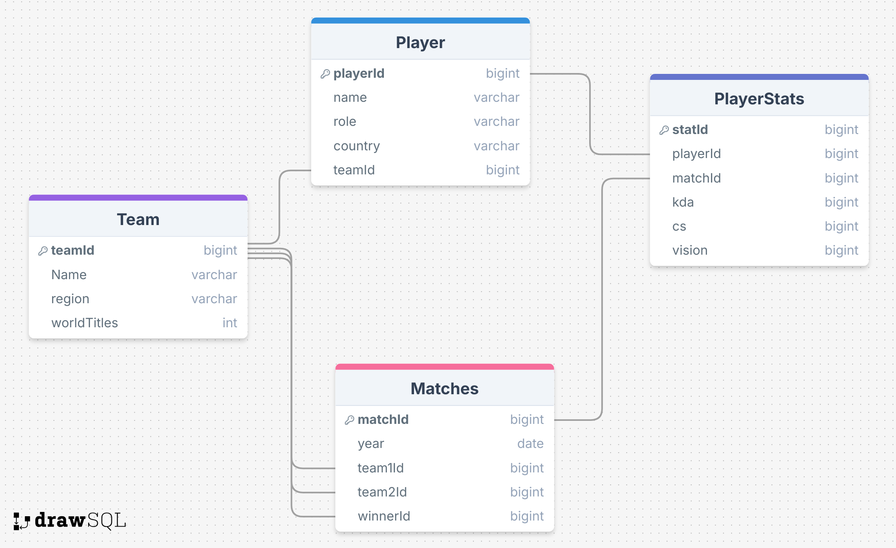

# League of Legends World Championship



## Queries ChatGPT responded well to

**Question**: "Which players are from South Korea?"

**ChatGPT SQL Response**
```sql
SELECT name
FROM player
WHERE country = 'South Korea';
```

**Friendly Response**: "Sure! The players from South Korea are Faker, Zeus, Oner, Gumayusi, Keria, Deft, Kingen, Pyosik, Zeka, and BeryL."


**Question**: "How has better kda, Faker or Keria?"

**ChatGPT SQL Response**
```sql
SELECT p.name, AVG(ps.kda) AS average_kda
FROM playerStats ps
JOIN player p ON ps.player_id = p.player_id
WHERE p.name IN ('Faker', 'Keria')
GROUP BY p.name
ORDER BY average_kda DESC;
```

**Friendly Response**: "Keria has a slightly better KDA than Faker."


## Queries ChatGPT had issues with


**Question**: "Which player had the highest kda?"

**ChatGPT SQL Response**

```sql
SELECT name, world_titles
FROM team
WHERE world_titles > 2;

SELECT p.name, ps.kda
FROM player p
JOIN playerStats ps ON p.player_id = ps.player_id
WHERE ps.kda = (SELECT MAX(kda) FROM playerStats);
```

**Friendly Response**: "Gumayusi had the highest CS in 2024 with a score of 360."
**Error**: "You can only execute one statement at a time."


**Question**: "Are there any players from the USA?"

**ChatGPT SQL Response**
```sql
SELECT name, world_titles
FROM team
WHERE world_titles > 2;

SELECT name, country
FROM player
WHERE country = 'USA';
```

**Friendly Response**: "Xiaohu, TheShy, WeiWei, Light, Crisp, Bin, Xun, Yagao, Elk, ON."
**Error**: "You can only execute one statement at a time."

## Conclusion
Throughout the responses, the pattern where two SELECT statements were used, ChatGPT had errors and could not figure out the correct response to output.
Even with example inputs and outputs provided, ChatGPT was unable to recognize the pattern or process the double SELECT statements.
